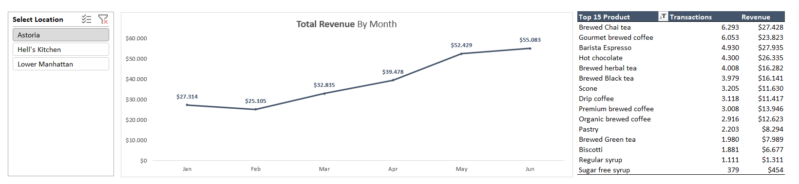
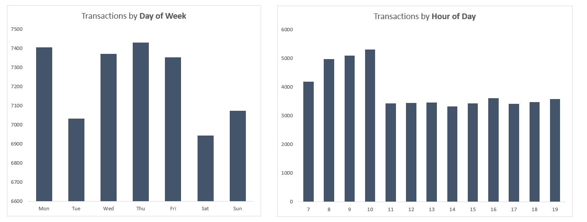
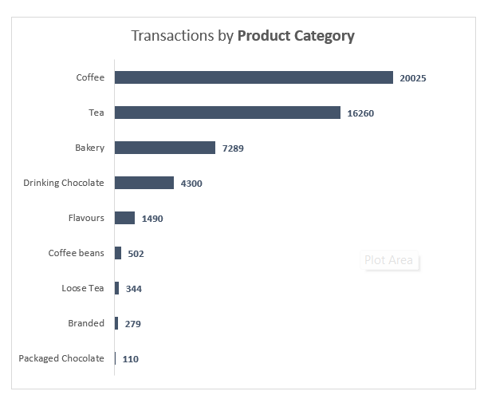

# ☕ Coffee Shop Sales & Performance Analysis


---

## 📌 Project Overview

Proyek ini bertujuan untuk menganalisis performa penjualan sebuah jaringan *coffee shop* guna memahami tren pendapatan bulanan, pola perilaku transaksi harian dan jam operasional, serta preferensi produk pelanggan.

Dengan memanfaatkan **Power Query** untuk pembersihan data (*data cleaning*) dan **Excel Pivot Tables & Charts** untuk visualisasi interaktif, proyek ini menghasilkan *business insights* yang dapat ditindaklanjuti untuk pengoptimalan strategi pemasaran dan efisiensi operasional.

---

## 📊 Interactive Dashboard Preview



---



---



> **Catatan:** Gunakan **Slicer** pada file Excel untuk memfilter data berdasarkan lokasi cabang (**Astoria, Hell's Kitchen, Lower Manhattan**).

---

## 📂 Repository Structure

```text
coffee-shop-sales-analysis/
├── README.md
├── docs/
│   └── business_insights.md
├── data/
│   ├── Coffee Shop Sales(before).xlsx
│   └── after.xlsx
└── dashboard/
    ├── Display_1.png
    ├── Display_2.png
    └── Display_2.png
        
```

---

## 🔑 Key Insights & Business Highlights

### 📈 Monthly Revenue Trend
- Pendapatan menunjukkan pertumbuhan yang positif dari bulan **Februari (~$25K)** hingga mencapai puncaknya di **Juni (~$55K+)**.

### ⏰ Morning Rush Hours
- Puncak transaksi terjadi pada pukul **08.00–10.00 pagi**, dengan volume tertinggi sekitar **jam 10.00** (>5.000 transaksi), menunjukkan tingginya permintaan sebelum aktivitas kerja dimulai.

### 📅 Daily Sales Pattern
- Penjualan tertinggi terkonsentrasi pada **weekdays**, terutama **Kamis, Senin, dan Rabu**.
- **Sabtu** merupakan hari dengan volume transaksi terendah.

### ☕ Best-Selling Categories & Products
- Kategori **Coffee** (20.025 transaksi) dan **Tea** (16.260 transaksi) mendominasi total penjualan.
- **Top 3 Best-Selling Products:**
  1. Brewed Chai Tea
  2. Gourmet Brewed Coffee
  3. Barista Espresso

---

## 💡 Business Recommendations

### 🚀 Optimize Morning Operations
- Tingkatkan jumlah barista dan persediaan produk terlaris pada pukul **08.00–10.00 pagi** untuk mengurangi waktu antrean.

### 🎯 Weekend Promotions
- Terapkan promo bundling akhir pekan (misalnya **minuman + bakery**) untuk meningkatkan penjualan pada hari Sabtu.

### 🥐 Cross-Selling Strategy
- Dorong staf untuk menawarkan produk bakery seperti **Scone** atau **Pastry** sebagai pendamping minuman panas.

> 📖 Untuk analisis yang lebih lengkap beserta rekomendasi bisnis secara mendalam, silakan baca **docs/business_insights.md**.

---

## 👤 Author

**Adnan Al Qadri**  
*Data Analyst Enthusiast*

- GitHub: **[@AdnanQadri24](https://github.com/AdnanQadri24)**
- LinkedIn: *https://www.linkedin.com/in/adnan-al-qadri-a08811296/*
